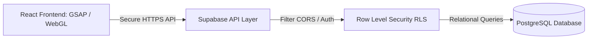

# Cinematic Decoupled Architecture Skill

This skill provides the architectural blueprints, security practices, and premium visual guidelines to build **cinematographic, high-impact web platforms** powered by **scalable, decoupled, and secure SaaS backends**. 

It focuses on decoupling the visual presentation (WebGL, GSAP, Canvas) from the business logic and database layers, ensuring the Single Responsibility Principle (SRP) is maintained so that no single failure breaks the entire application.

---

## 1. Visual Style & Immersive Frontend (The "Cinematic" Standard)
Inspired by top-tier creative agencies (e.g., **Resn, Active Theory**), a cinematic web experience goes beyond standard grid layouts. It treats the browser as an interactive movie canvas.

### Core Cinematic Principles
1. **Dynamic Immersive Backgrounds:** Avoid flat solid backgrounds. Use subtle organic noise/grain overlays, rich atmospheric gradients (with custom hue transitions), video loops, or WebGL/Canvas-based particle fields that react to mouse movements.
2. **Scroll-Driven Storytelling (Scrollytelling):** Connect user scrolling to element properties using **GSAP (ScrollTrigger)** or **Framer Motion**. Text should fade, mask-reveal, or rotate elegantly in 3D space, guiding the user through the narrative.
3. **Smooth Page Transitions (PJAX / Routing):** Page loads must never flash white. Use custom route transitions (e.g., exit wipe animations, scale transitions, slide-up panels) to keep the experience completely fluid.
4. **Micro-Animations & Interactive Feedback:** 
   * **Custom Cursors:** Replace default cursors with interactive circular SVG cursors that scale, morph, or display text labels (e.g., "Ver Más", "Play") when hovering over interactive nodes.
   * **Glassmorphism & Depth:** Layer components with light backdrop blurs (`backdrop-filter: blur(12px)`), thin reflective borders, and subtle box shadows to create physical depth.
5. **Bold, Expressive Typography:** Pair a sleek, geometric display font (e.g., *Syne, Outfit, Cl clash, Lexend*) for headlines with a clean, readable sans-serif (e.g., *Inter, Plus Jakarta Sans*) for content. Heading scales should be dramatic (Golden Ratio scale).

---

## 2. Frontend Structure (Single Responsibility Principle)
A cinematic site requires modular code so complex canvas components, GSAP timelines, and data endpoints do not overlap. The project folder structure must isolate components by feature area:

```text
src/
├── assets/             # Media assets (cinematic background loops, logos, sound design)
├── components/         # Global reusable design system components
│   ├── ui/             # Glassmorphic cards, custom premium buttons, circular custom cursor
│   └── shared/         # Fluid Navigation bar, custom cinematic page transitions, global Toast
├── features/           # Modular business slices (Each is self-contained)
│   ├── home/           # Narrative scrollytelling introduction & branding
│   ├── academy/        # E-learning, custom video player, course progress
│   ├── services/       # Interactive client maps, consultancies & project audits
│   ├── experience/     # Ecological reservation forms, timeline events
│   └── partner-portal/ # Secret partner dashboard, KPI charts, secure tools
├── context/            # Global React states (e.g., AuthState, CartState, CinematicState)
├── hooks/              # Custom React hooks (e.g., useGsapReveal, useSupabaseAuth)
├── services/           # Supabase connection clients and external API adapters
├── App.jsx             # React enrutador and cinematic route wrappers
└── main.jsx            # Entry point
```

---

## 3. Decoupled Backend & Database (Supabase Stack)
To make the project replicable, use a Serverless BaaS (Backend-as-a-Service) model like **Supabase (PostgreSQL)**. This eliminates the need to maintain complex API servers while guaranteeing instant scale.



### PostgreSQL Relational Schema Blueprint
Keep tables decoupled. For example, for an E-learning + B2B consulting app:
* `profiles` (id, email, name, role [admin, partner, client, student], created_at)
* `courses` (id, title, instructor, is_premium, created_at)
* `enrollments` (id, user_id, course_id, payment_status, progress, created_at)
* `projects` (id, client_id, title, status, progress_percent, audit_pdf_url, lead_partner_id)
* `time_logs` (id, partner_id, project_id, hours, description, logged_at)

---

## 4. Hardened Security Guidelines
Security must be enforced at the data layer (database) rather than relying solely on frontend hides/shows.

### A. Row Level Security (RLS) Policies
Never expose data tables publicly without strict policies. In PostgreSQL (Supabase), write precise SQL policies:

```sql
-- 1. Enable RLS on tables
ALTER TABLE projects ENABLE ROW LEVEL SECURITY;

-- 2. Policy: Clients can only read their own projects
CREATE POLICY "Clients can view their own projects" 
ON projects FOR SELECT 
USING (auth.uid() = client_id);

-- 3. Policy: Partners (Admins) can manage all projects
CREATE POLICY "Partners have full access" 
ON projects FOR ALL 
USING (
  EXISTS (
    SELECT 1 FROM profiles 
    WHERE profiles.id = auth.uid() AND profiles.role = 'partner'
  )
);
```

### B. CORS Configuration
In Supabase/Hosting platforms, explicitly whitelist the production domains and development environments:
* **Allowed Origins:** `https://seram.com`, `http://localhost:5173`
* **Blocked Origins:** `*` (Disable wildcard matching in production APIs)

### C. Security Headers
Ensure your hosting server (Vercel, Netlify, or custom Nginx) sends protective headers:
1. `Content-Security-Policy (CSP):` Whitelist authorized scripts, frames (e.g., Stripe, YouTube), and style sources.
2. `X-Frame-Options: DENY` (Prevents clickjacking).
3. `Strict-Transport-Security (HSTS):` Enforces HTTPS connections.
4. `X-Content-Type-Options: nosniff` (Prevents MIME-sniffing exploits).

---

## 5. Documentation Blueprints
Every scalable project must include a `/docs` directory inside its workspace. This ensures the project is completely replicable by any other agent, developer, or team member:

* **PRD (Product Requirements Document):** Outlines business goals, user personas (Student, Client, Partner), and modules.
* **TRD (Technical Requirements Document):** Outlines technology choices (Vite + React, Tailwind, Supabase, GSAP) and configurations.
* **UI/UX Guidelines:** Defines HSL color palettes, custom typography, animations scales, and custom components behaviors.
* **Database Schema:** Entity-relationship diagrams and field details.
* **Implementation Plan:** Phased rollouts (e.g., Phase 1: Cinematic UI, Phase 2: Refactoring components, Phase 3: Supabase setup).

---

## 6. WebGL Parallax Engine (3D Immersive Background)
For cinematic hero sections and scroll-driven narratives, use the **ParallaxEngine** pattern.
Full skeleton and React integration template are in `references/webgl-parallax-engine.js`.

### Core Design Contracts (NEVER violate)
1. **Canvas is background-only:** Always `position: fixed; z-index: 0; pointer-events: none`.
2. **HTML floats above:** All React UI content must have `z-index: 10+`.
3. **Scroll moves the camera Z, not the HTML.** Use a `.scroll-proxy` div as height anchor for GSAP ScrollTrigger.
4. **All interpolation uses LERP** with `factor ≤ 0.1` for cinematic fluidity.
5. **pixelRatio cap at 2** for performance on 4K/Retina screens.

### 3D Layer Hierarchy (Z-axis — immutable contract)
| Layer          | Z Position | Purpose                          |
|:---------------|:----------:|:---------------------------------|
| Camera Start   |    +5      | User viewpoint on page load      |
| Foreground FG  |  +1 / +2   | Fast-moving particles / decor    |
| Midground Mid  |    -5      | Main hero content / product      |
| Background BG  |   -15      | Spatial scale / atmosphere       |
| Camera End     |    -8      | Destination after full scroll    |

### LERP Formula (apply every RAF frame)
```js
// Cursor parallax (XY) — lerpFactor = 0.05
targetX += (mouseX * 0.0015 - targetX) * 0.05;

// Scroll depth (Z) — lerpFactor = 0.1
camera.position.z += (cameraZTarget - camera.position.z) * 0.1;
```

### Recommended React Stack
```bash
npm install three @react-three/fiber @react-three/drei gsap @gsap/react
```
- `@react-three/fiber` → Declarative Three.js in React (handles renderer lifecycle)
- `@react-three/drei` → Helpers: `Environment`, `Float`, `Text3D`, `OrbitControls`
- `gsap + ScrollTrigger` → Drives camera Z from scroll position (`scrub: 1.2`)
