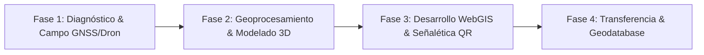

# PROPUESTA TÉCNICO-COMERCIAL: SISTEMAS DE INFORMACIÓN GEOGRÁFICA (SIG) APLICADOS A PROYECTOS AMBIENTALES, RUTAS Y DESTINOS ECOTURÍSTICOS INTELIGENTES

**Documento Marco Replicable — SERAM S.R.L.**  
*Servicios Ambientales, Consultoría Geotecnológica & Soluciones Digitales*

---

## FICHA TÉCNICA DEL DOCUMENTO

| Parámetro | Detalle |
| :--- | :--- |
| **Proponente** | **SERAM S.R.L. — Servicios Ambientales & Geotecnológicos** |
| **Tipo de Propuesta** | Modelo Replicable Técnico-Económico (TDR / Oferta de Servicios) |
| **Área Técnica** | Geotecnologías, SIG, Teledetección y Ecoturismo Sostenible |
| **Aplicabilidad** | Parques Naturales, Reservas Municipales/Privadas, Rutas de Senderismo, Destinos Ecoturísticos y Gobiernos Locales |
| **Versión** | 2.5 (Agosto 2026 — Actualizada con Benchmarking de Mercado) |
| **Contacto** | consultoria@seram.com.bo \| www.seram.com.bo |

---

## 1. RESUMEN EJECUTIVO

El ecoturismo moderno y la gestión ambiental sostenible requieren superar la cartografía estática tradicional. La falta de datos geoespaciales precisos genera desorientación en los visitantes, riesgos de accidentes en campo, sobrecarga en zonas ecológicamente frágiles y pérdida de oportunidades de promoción turística de alto valor.

**SERAM S.R.L.** propone una solución integral basada en **Geotecnologías y Sistemas de Información Geográfica (SIG)** aplicada al diseño, diagnóstico, zonificación y digitalización de rutas y destinos ecoturísticos. Mediante el uso combinado de fotogrametría aérea con drones, receptores satelitales GNSS de alta precisión, modelamiento de elevación 3D y visores WebGIS interactivos en la nube, transformamos cualquier circuito natural en un **Destino Ecoturístico Inteligente y Seguro**.

Esta propuesta se estructura de forma **modular en tres paquetes de servicio** (Esencial Cartográfico, WebGIS Digital e Integral 360°), respaldada por un exhaustivo **estudio comparativo de mercado y análisis de precios unitarios (APU)** frente a empresas tradicionales de topografía, consultoras ambientales clásicas y agencias de software.

---

## 2. DIAGNÓSTICO Y JUSTIFICACIÓN DEL PROBLEMA

### 2.1 Problemática Común en Destinos Ecoturísticos y Senderos
1. **Incertidumbre en Campo y Falta de Señalización Inteligente:** Senderos sin georreferenciación confiable, perfiles altimétricos desconocidos y carencia de información sobre dificultad física y puntos de agua/seguridad.
2. **Impacto Ambiental y Ausencia de Capacidad de Carga:** Rutas trazadas sin análisis de pendientes críticas, susceptibilidad a la erosión o proximidad a nidos/ecosistemas frágiles, provocando degradación del suelo.
3. **Brecha Digital en la Experiencia del Turista:** Falta de tracks descargables (GPX/KMZ) compatibles con smartwatches/smartphones y ausencia de visores web interactivos donde el visitante pueda explorar la ruta antes de llegar.
4. **Debilidad en la Gestión y Mantenimiento:** Los administradores del destino carecen de una Geodatabase unificada para planificar cuadrillas de mantenimiento, monitoreo de flora/fauna y atención de contingencias.

### 2.2 La Ventaja Diferencial de SERAM S.R.L.
* **Rigor de Ingeniería Ambiental Colegiada (RENCA):** No somos solo desarrolladores web ni solo topógrafos; combinamos auditoría ambiental, modelamiento hidrológico/erosivo y desarrollo tecnológico.
* **Ecosistema Digital Abierto (Zero Lock-in):** Entregamos datos en estándares abiertos (GeoPackage, GeoJSON, GPX, OGC) y desarrollamos visores en la nube sin costo recurrente excesivo de licencias propietarias de software GIS.
* **Señalética Conectada:** Vinculación de infraestructura física (postes/hitos de sendero) con micro-sitios informativos mediante códigos QR geolocalizados que funcionan incluso con conectividad limitada.

---

## 3. INVESTIGACIÓN DE MERCADO Y ANÁLISIS DE LA COMPETENCIA (BENCHMARKING)

Para garantizar la máxima competitividad técnico-económica de esta propuesta, SERAM S.R.L. realizó un análisis comparativo de las tarifas y alcances ofrecidos por los distintos actores del mercado en Bolivia y Latinoamérica:

```
┌───────────────────────────────────────────────────────────────────────────────────────────────┐
│                          MATRIZ COMPARATIVA DE MERCADO & COMPETENCIA                          │
├───────────────────────┬──────────────────────┬────────────────────────┬───────────────────────┤
│ Proveedor / Sector    │ Alcance Típico       │ Rango de Precios       │ Limitaciones / Brechas│
├───────────────────────┼──────────────────────┼────────────────────────┼───────────────────────┤
│ 1. Empresas de        │ Vuelo de dron RGB,   │ $800 - $2.500 USD por  │ Sin análisis de       │
│ Topografía Tradicional│ ortofoto, curvas de  │ jornada/vuelo base     │ capacidad de carga,   │
│ & Drones (ej. vuelos  │ nivel en CAD /       │ ($15 - $35 USD/ha      │ sin visores web ni    │
│ comerciales)          │ Civil 3D.            │ en áreas medias).      │ enfoque ecoturístico. │
├───────────────────────┼──────────────────────┼────────────────────────┼───────────────────────┤
│ 2. Consultoras        │ Trámites y licencias │ $2.000 - $5.000 USD    │ Cartografía estática  │
│ Ambientales Clásicas  │ RENCA (FNCA, EEIA,   │ por estudio ambiental  │ en PDF/Shapefile      │
│ (ej. firmas locales   │ monitoreos).         │ estándar.              │ plano; sin tecnología │
│ de evaluación)        │                      │                        │ interactiva web/móvil.│
├───────────────────────┼──────────────────────┼────────────────────────┼───────────────────────┤
│ 3. Agencias de        │ Desarrollo web y apps│ $3.000 - $8.000 USD    │ Desconocen normativa  │
│ Software / Agencias   │ a medida en la nube. │ solo por programación  │ ambiental, geodesia,  │
│ de Diseño             │                      │ y diseño visual.       │ drones ni GIS técnico.│
├───────────────────────┼──────────────────────┼────────────────────────┼───────────────────────┤
│ 4. SERAM S.R.L.       │ Solución Integral:   │ $1.650 - $6.200 USD    │ Cero dependencias;    │
│ (Geotecnología +      │ Drones + GNSS +      │ (Paquetes A, B y C     │ máxima optimización   │
│ Ambiental + WebGIS)   │ WebGIS + Cap. Carga  │ llave en mano con      │ de costos y valor     │
│                       │ + Señalética QR.     │ ahorro de hasta 37%).  │ agregado directo.     │
└───────────────────────┴──────────────────────┴────────────────────────┴───────────────────────┘
```

### 3.1 Análisis de Precios Unitarios de Mercado (APU de Referencia)
* **Jornada de Campo Brigada Geodésica/Dron (Piloto + Técnico GNSS + Equipos RTK):** \$450 - \$650 USD/día.
* **Tracking GNSS Submétrico de Senderos (Levantamiento continuo + POIs + Ficha):** \$45 - \$75 USD por km lineal.
* **Procesamiento Fotogramétrico HD + MDT/MDS + Pendientes:** \$10 - \$20 USD por hectárea.
* **Desarrollo de Visor WebGIS Interactivo en la Nube (Cloud GIS):** \$1.500 - \$3.500 USD según interactividad.
* **Estudio Científico de Capacidad de Carga Turística (Metodología Cifuentes/UICN):** \$1.800 - \$3.200 USD.
* **Diseño e Integración de Red de Señalética Inteligente QR:** \$600 - \$1.200 USD.

> **Estrategia de Precios de SERAM:** Al contar con equipamiento propio (drones, receptores GNSS multiconstelación) y una infraestructura tecnológica basada en stack abierto (MapLibre, Supabase/PostGIS, Tailwind), eliminamos costos de intermediación y licencias propietarias recurrentes, trasladando un **ahorro de entre 30% y 37% al cliente final** en comparación con contratar proveedores fragmentados.

---

## 4. OBJETIVOS DEL PROYECTO

### 4.1 Objetivo General
Diseñar, relevar, modelar y digitalizar de manera geotecnológica las rutas, senderos y atractivos biofísicos del destino ecoturístico, garantizando la conservación de los ecosistemas, la seguridad del visitante y una experiencia inmersiva mediante herramientas SIG y WebGIS.

### 4.2 Objetivos Específicos
1. **Relevamiento Espacial de Alta Precisión:** Capturar la traza exacta de senderos, puntos de interés (POIs), miradores, fuentes de agua, infraestructura y zonas de riesgo con GNSS y fotogrametría de dron.
2. **Modelado y Análisis Espacial:** Generar Modelos Digitales de Terreno (MDT/MDS), mapas de pendientes, perfiles de elevación acumulada y zonificación de aptitud ambiental.
3. **Desarrollo de Plataforma WebGIS:** Implementar un visor cartográfico interactivo y responsive (móvil/desktop) para la navegación, visualización 3D y consulta de fichas técnicas de la ruta.
4. **Optimización de la Experiencia del Visitante:** Producir tracks digitales estandarizados (GPX/KMZ/KML) y diseñar el sistema de señalética física y digital con QR interactivos.
5. **Transferencia Técnica y Geodatabase:** Capacitar al personal local y transferir la Geodatabase estructurada para la gestión autónoma del destino.

---

## 5. METODOLOGÍA DE TRABAJO (FASES DE EJECUCIÓN)



### FASE 1: Diagnóstico Territorial, Trabajo de Campo y Captura Espacial
* **Planificación de Vuelo y Seguridad:** Trámite de autorizaciones, definición de mallas fotogramétricas y puntos de control terrestre (GCPs).
* **Levantamiento Fotogramétrico con Dron:** Captura de ortofotomosaicos en RGB de alta resolución espacial (GSD < 3-5 cm/píxel) para áreas críticas, miradores y accesos principales.
* **Tracking y Caracterización GNSS en Sendero:**
  - Registro de trazas continuas con receptores satelitales multifrecuencia.
  - Levantamiento de Puntos de Interés (POIs): atractivos geológicos, cascadas, avistamiento de aves, refugios, áreas de acampe, bifurcaciones y zonas de precaución (pasos expuestos, cruces de río).
  - Ficha de campo ambiental: estado del suelo, erosión, tipo de vegetación y cobertura arbórea.

### FASE 2: Geoprocesamiento, Análisis Espacial y Modelado 3D
* **Generación de Ortomosaicos y Modelos de Elevación:**
  - Ortofotomapa georreferenciado corregido radiométricamente.
  - Modelo Digital de Terreno (MDT) y Modelo Digital de Superficie (MDS).
* **Análisis Topográfico y Morfométrico:**
  - Curvas de nivel a equidistancia de 1m / 5m.
  - Mapa de pendientes (% e inclinación en grados) para cálculo de dificultad física (escala MIDE / IBP Index).
  - Perfiles altimétricos longitudinales (distancia vs. desnivel positivo/negativo acumulado).
* **Zonificación de Fragilidad y Capacidad de Carga:**
  - Cruce espacial multicriterio (pendientes + cuerpos de agua + zonas de anidación) para definir buffers de protección.
  - Estimación de Capacidad de Carga Turística (Carga Física, Real y Efectiva/Manejable).

### FASE 3: Desarrollo y Despliegue de la Solución Digital Ecoturística
* **Visor WebGIS Interactivo en la Nube:**
  - Interfaz web responsive optimizada para smartphones y computadoras de escritorio.
  - Visualización 2D/3D del relieve con control de capas (senderos, miradores, servicios, curvas de nivel).
  - Popups interactivos multimedia por cada POI (fotografías de alta resolución, descripción botánica/geológica, altitud, coordenadas, recomendaciones).
  - Herramientas de medición en pantalla (distancia, perfil de elevación dinámico al pasar el cursor).
* **Paquete de Navegación Offline para Turistas:**
  - Exportación de archivos GPX, KMZ y GeoJSON listos para apps como Wikiloc, Strava, Garmin, Gaia GPS, AllTrails y Google Earth.
* **Diseño del Sistema de Señalética Inteligente (QR):**
  - Plantillas de señalética física de bajo impacto ambiental con paleta acorde al entorno natural.
  - Inclusión de códigos QR dinámicos que enlazan a la ficha geolocalizada en el visor web (audioguía, mapa del tramo y botón de auxilio/contacto).

### FASE 4: Capacitación, Transferencia Tecnológica y Entrega Final
* **Estructuración de Geodatabase:** Entrega en formatos estándar interoperables (ESRI File Geodatabase `.gdb`, GeoPackage `.gpkg` y Shapefiles `.shp`).
* **Atlas Cartográfico en Alta Definición:** Planos temáticos listos para impresión (PDF Vectorial A1/A2/A3) con membrete institucional, escala, grilla de coordenadas UTM/WGS84 y simbología estandarizada.
* **Taller de Capacitación Técnica:** Sesión teórico-práctica para administradores del destino sobre carga de nuevos puntos, actualización del visor y uso de receptores GPS.

---

## 6. ESTRUCTURA MODULAR POR PAQUETES DE SERVICIO

```
┌─────────────────────────────────────────────────────────────────────────────┐
│                            PAQUETES DE SERVICIO                             │
├────────────────────────┬────────────────────────────┬───────────────────────┤
│   PAQUETE A (BASE)     │   PAQUETE B (AVANZADO)     │  PAQUETE C (PREMIUM)  │
│  Esencial Cartográfico │      WebGIS Digital        │  Integral 360° Destino│
│   & Senderos Básicos   │ & Experiencia del Visitante│     Inteligente       │
└────────────────────────┴────────────────────────────┴───────────────────────┘
```

### 6.1 PAQUETE A: Esencial Cartográfico & Senderos (Base)
*Ideal para destinos que necesitan regularizar su cartografía, señalizar rutas y contar con mapas impresos y archivos GPS oficiales.*

**Incluye:**
1. Relevamiento GNSS de hasta **15 km de senderos** y hasta **20 POIs**.
2. Vuelo de dron fotogramétrico en accesos y atractivos principales (hasta 50 hectáreas).
3. Modelo Digital de Terreno (MDT), Curvas de nivel y Mapa de pendientes.
4. Perfiles altimétricos detallados y cálculo de dificultad física por tramo.
5. Atlas cartográfico en PDF de alta resolución (3 láminas temáticas normalizadas).
6. Archivos de navegación digital exportados en formatos `.GPX`, `.KMZ` y `.SHP`.
7. Informe Técnico de diagnóstico del sendero con recomendaciones de seguridad y mantenimiento.

---

### 6.2 PAQUETE B: WebGIS Digital & Experiencia del Visitante (Recomendado)
*Diseñado para reservas, operadores y municipios que buscan posicionarse digitalmente, ofreciendo una experiencia moderna e interactiva al ecoturista.*

**Incluye todo lo del PAQUETE A, más:**
1. Relevamiento ampliado de hasta **35 km de senderos** y hasta **45 POIs**.
2. Vuelo con dron fotogramétrico de hasta **150 hectáreas** (ortofoto HD).
3. **Plataforma WebGIS Interactiva en la Nube:**
   - Dominio / subdominio web personalizado con visor de mapas 2D/3D.
   - Fichas interactivas multimedia por punto de interés.
   - Gráfico de perfil altimétrico interactivo vinculado al mapa en tiempo real.
   - Botón de descarga directa de tracks GPX/KMZ para los visitantes.
4. **Diseño de Señalética Inteligente:**
   - 10 plantillas de paneles/hitos de sendero con códigos QR geolocalizados.
   - Enlace directo a micro-fichas técnicas de orientación offline.
5. Mini-guía digital del sendero (formato PDF interactivo para WhatsApp/descarga web).
6. Taller de capacitación virtual/presencial (4 horas) para el equipo técnico gestor.

---

### 6.3 PAQUETE C: Ecoturístico Integral 360° & Smart Destination (Premium)
*La solución definitiva para parques nacionales, destinos turísticos emblemáticos o proyectos de cooperación internacional que requieren rigor científico, turismo inteligente y sostenibilidad a largo plazo.*

**Incluye todo lo del PAQUETE B, más:**
1. Relevamiento de red completa de senderos (hasta **70 km**) y POIs ilimitados.
2. Cobertura fotogramétrica y teledetección satelital de hasta **400 hectáreas**.
3. **Estudio Científico de Capacidad de Carga y Fragilidad Ecológica:**
   - Análisis multicriterio de susceptibilidad erosiva y riesgo geológico.
   - Determinación matemática de Carga Física, Real y Efectiva de visitantes.
   - Propuesta de zonificación de uso (Zona Intangible, Uso Restringido, Uso Intensivo).
4. **Módulo WebGIS Avanzado & Dashboard de Gestión:**
   - Tour virtual 360° panorámico integrado en miradores clave.
   - Panel de control administrativo para registro de visitas y alertas de mantenimiento.
   - Integración con base de datos Cloud (Supabase/PostGIS) con acceso multiusuario.
5. **Programa de Formación y Certificación SERAM Academy:**
   - Taller completo de 12 horas en manejo de QGIS/WebGIS y mantenimiento de senderos.
   - Certificados digitales avalados por SERAM S.R.L. para el personal y guardaparques.
6. Soporte técnico prioritario y actualización cartográfica durante 6 meses.

---

## 7. MATRIZ COMPARATIVA DE ENTREGABLES

| Entregable / Característica | Paquete A (Esencial) | Paquete B (WebGIS Digital) | Paquete C (Integral 360°) |
| :--- | :---: | :---: | :---: |
| **Límite de Red de Senderos Relevada** | Hasta 15 km | Hasta 35 km | Hasta 70 km |
| **Levantamiento Fotogramétrico con Dron** | 50 ha | 150 ha | 400 ha |
| **Archivos de Navegación (.GPX / .KMZ / .KML)** | ✅ Sí | ✅ Sí | ✅ Sí |
| **Atlas Cartográfico en PDF (Láminas A1/A2)** | ✅ 3 Láminas | ✅ 6 Láminas | ✅ 12 Láminas + Atlas |
| **Geodatabase Vectorial (.GDB / .GPKG / .SHP)** | ✅ Estándar | ✅ Avanzada | ✅ Completa PostGIS |
| **Perfiles Altimétricos e Índice de Dificultad** | ✅ Estático | ✅ Interactivo Web | ✅ Interactivo + 3D |
| **Visor WebGIS Interactivo en la Nube** | ❌ No | ✅ Incluido | ✅ Incluido + 360° Panos |
| **Sistema de Señalética con Códigos QR** | ❌ No | ✅ 10 Diseños | ✅ Red Completa |
| **Estudio de Capacidad de Carga Turística** | ❌ No | ❌ No | ✅ Incluido |
| **Zonificación de Fragilidad y Riesgo** | ❌ No | ❌ No | ✅ Incluido |
| **Dashboard de Administración y Visitas** | ❌ No | ❌ No | ✅ Incluido |
| **Capacitación Técnica** | 2 Horas | 4 Horas | 12 Horas (Academy) |
| **Garantía y Soporte Técnico Post-Entrega** | 1 Mes | 3 Meses | 6 Meses |

---

## 8. CRONOGRAMA DE EJECUCIÓN

El plazo de ejecución estándar varía entre **4 y 8 semanas** según el paquete seleccionado:

```
┌────────────────────────────────────────────────────────────────────────────────────────┐
│                        CRONOGRAMA DE ACTIVIDADES (SEMANAS)                             │
├─────────────────────────────────────────┬─────┬─────┬─────┬─────┬─────┬─────┬─────┬─────┤
│ Actividad / Hito                        │ S1  │ S2  │ S3  │ S4  │ S5  │ S6  │ S7  │ S8  │
├─────────────────────────────────────────┼─────┼─────┼─────┼─────┼─────┼─────┼─────┼─────┤
│ 1. Planificación, Línea Base y Vuelos   │ ███ │ ███ │     │     │     │     │     │     │
│ 2. Tracking GNSS y Relevamiento POIs    │     │ ███ │ ███ │     │     │     │     │     │
│ 3. Procesamiento Fotogramétrico & MDT   │     │     │ ███ │ ███ │     │     │     │     │
│ 4. Análisis de Pendientes y Perfiles    │     │     │     │ ███ │ ███ │     │     │     │
│ 5. Desarrollo de Visor WebGIS & QR      │     │     │     │     │ ███ │ ███ │     │     │
│ 6. Estudio de Capacidad de Carga (Pkg C)│     │     │     │     │     │ ███ │ ███ │     │
│ 7. Control de Calidad y Pruebas Web     │     │     │     │     │     │     │ ███ │     │
│ 8. Capacitación y Entrega Final         │     │     │     │     │     │     │     │ ███ │
└─────────────────────────────────────────┴─────┴─────┴─────┴─────┴─────┴─────┴─────┴─────┘
```

*Nota: Para el Paquete A el cronograma total es de 4 semanas; para el Paquete B es de 6 semanas; para el Paquete C es de 8 semanas.*

---

## 9. PROPUESTA ECONÓMICA AJUSTADA Y CONDICIONES COMERCIALES

### 9.1 Tabla de Precios Ajustada y Ahorro Frente al Mercado

| Paquete | Alcance Principal | Valor de Mercado Desagregado* | Tarifa SERAM S.R.L. (USD)** | Tarifa SERAM S.R.L. (BOB)** | Ahorro Cliente |
| :--- | :--- | :---: | :---: | :---: | :---: |
| **PAQUETE A** | Esencial Cartográfico & Senderos Básicos (15 km) | ~$ 2.350 USD | **$ 1.650 USD** | **11.500 BOB** | **~30%** |
| **PAQUETE B** | WebGIS Digital & Experiencia del Visitante (35 km) | ~$ 5.200 USD | **$ 3.450 USD** | **23.900 BOB** | **~34%** |
| **PAQUETE C** | Integral 360° Destino Inteligente & Capacidad de Carga (70 km) | ~$ 9.800 USD | **$ 6.200 USD** | **43.000 BOB** | **~37%** |

*\*Estimación promedio de mercado si el cliente contratara servicios separados de vuelo topográfico, consultoría ambiental clásica y desarrollo web externo.*  
*\*\*Los valores no incluyen viáticos de traslado y hospedaje en campo si el proyecto se sitúa a más de 100 km de la base operativa de SERAM S.R.L. Precios sujetos a ajuste según características topográficas extremas o requerimientos adicionales de consultoría ambiental.*

### 9.2 Forma de Pago por Hitos de Entrega
* **40% a la Firma del Contrato / Orden de Proceder:** Habilita la movilización de cuadrilla técnica y equipos de campo (drones, GNSS).
* **30% a la Aprobación de la Cartografía Base y Modelos 3D:** Presentación del ortomosaico, perfiles de elevación y trazado validado.
* **30% a la Entrega Final:** Publicación definitiva del Visor WebGIS, entrega de Geodatabase, señalética QR, atlas cartográfico y realización del taller de capacitación.

### 9.3 Garantía Técnica y Validez de la Oferta
* **Garantía de Funcionamiento Web:** 99.9% de disponibilidad en la plataforma WebGIS alojada en infraestructura cloud.
* **Validez de la Propuesta:** 30 días calendario a partir de su emisión formal.

---

## 10. EQUIPO PROFESIONAL Y RESPALDO TÉCNICO

SERAM S.R.L. pone a disposición del proyecto un equipo multidisciplinario altamente calificado:

* **Director de Proyecto / Consultor Ambiental Senior:** Ingeniero Ambiental colegiado con más de 10 años de experiencia en estudios de impacto, áreas protegidas y ordenamiento territorial.
* **Especialista en SIG y Teledetección:** Ingeniero Geógrafo / Geotecnólogo experto en fotogrametría con drones, sensores remotos (Sentinel/Planet/LIDAR), ArcGIS Pro, QGIS y geoprocesamiento espacial.
* **Desarrollador WebGIS / Full-Stack:** Especialista en arquitectura Cloud, bases de datos espaciales (PostGIS/Supabase), librerías cartográficas web (MapLibre, Mapbox, Leaflet, Three.js) y diseño UI/UX responsivo.
* **Especialista en Turismo Sostenible y Trabajo de Campo:** Técnico en guiado de montaña y evaluación de senderos con certificación en primeros auxilios en áreas remotas (WFR).

### Equipamiento y Software
* **Hardware de Campo:** Drones profesionales con sensores de alta resolución (RGB 4K/20MP), receptores GNSS multiconstelación con precisión centimétrica RTK/PPK, sensores barométricos y tablets rugerizadas.
* **Software y Procesamiento:** Pix4D / Agisoft Metashape, QGIS 3.x, ArcGIS Pro, CloudCompare, GDAL/OGR y servidores cloud de alta disponibilidad.

---

## 11. ANEXO TÉCNICO: ESTÁNDARES Y FORMATOS DE ENTREGA

Todos los productos espaciales y digitales se entregarán bajo estrictas normas de estandarización geográfica internacional:

1. **Sistema de Referencia Espacial:** Proyección Universal Transversal de Mercator (UTM), Datum WGS-84 (Zona correspondiente 19S / 20S / 21S según localización geográfica del proyecto).
2. **Estructura Vectorial OGC:** Atributos limpios en UTF-8 con codificación estandarizada para nombres de senderos, kilometraje, desniveles acumulados, tipo de suelo y dificultad.
3. **Formatos Entregables:**
   - Vectoriales: `.gpkg` (GeoPackage), `.gdb` (Esri File Geodatabase), `.shp` (ESRI Shapefile), `.geojson`.
   - Navegación GPS: `.gpx` (GPS Exchange Format), `.kmz` / `.kml` (Google Earth).
   - Raster / Elevación: `.tif` (GeoTIFF con compresión LZW y pirámides de visualización construidas), `.las` / `.laz` (Nubes de puntos clasificadas).
   - Documentales: `.pdf` (Vectorial de alta resolución para imprenta a 300 DPI) y `.html` (Visor Web interactivo standalone y embebible).

---

**SERAM S.R.L. — Innovación Geotecnológica al Servicio de la Conservación y el Turismo Sostenible**  
*Cochabamba • Santa Cruz • La Paz — Bolivia*
