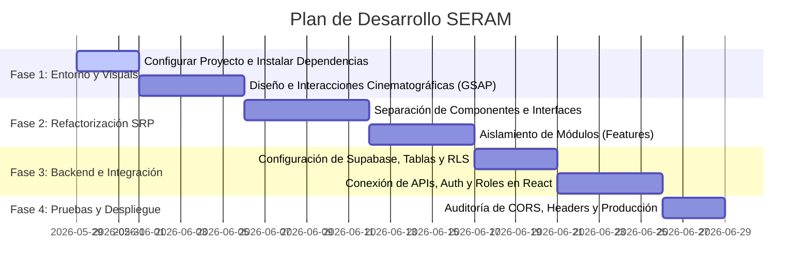

# Plan de Implementación y Refactorización - PROYECTO SERAM

Este documento describe la hoja de ruta y las fases de desarrollo tecnológico para reconstruir la plataforma del **PROYECTO SERAM** sobre la arquitectura desacoplada, segura y modular establecida.

---

## Hoja de Ruta de Desarrollo



---

## 1. Fase 1: Inicialización del Entorno y UI/UX Cinematográfica

El objetivo de esta fase es estructurar el proyecto en el código base y dotar a la interfaz del "wow-factor" interactivo (inspirado en Resn).

### Tareas Clave:

* **Instalación de Dependencias:** Incorporar librerías de animación y enrutamiento en `package.json`:
  ```bash
  npm install gsap @gsap/react framer-motion react-router-dom
  ```
* **Diseño del Custom Cursor:** Programar un componente cursor interactivo (`CustomCursor.jsx`) que reemplace el puntero predeterminado por un círculo verde dinámico con retraso físico.
* **Maquetación Atmosférica:** Modificar `index.css` e `index.html` para incorporar tipografías premium (`Outfit` e `Inter`) y el fondo de color slate profundo con ruido orgánico en CSS.
* **Transiciones de Sección:** Envolver el contenedor principal en transiciones suaves de Framer Motion.

---

## 2. Fase 2: Refactorización Bajo Principio de Responsabilidad Única (SRP)

En esta fase, fragmentaremos el archivo masivo `src/App.jsx` de 2,000 líneas en archivos independientes y modulares estructurados por carpetas de negocio.

### Tareas Clave:

* **Creación del Enrutador (Routing):** Configurar `react-router-dom` en `src/main.jsx` para gestionar las pestañas (*Inicio*, *Academy*, *Services*, *Experience*, *Shop*, *Dashboard*) como rutas URL reales (ej. `/academy`, `/dashboard`) en lugar de estados temporales de pestaña.
* **Migración de Módulos (Features):**
  * Extraer el código de la Academia y guardarlo en `/features/academy/`.
  * Extraer el panel directivo e intranet secreto de los socios y guardarlo en `/features/partner-portal/`.
  * Extraer la visualización de proyectos de consultoría y guardarla en `/features/services/`.
* **Componentes Compartidos (Shared Componentry):** Migrar el menú de navegación (Navbar), pie de página (Footer) y notificaciones emergentes (Toast) a la carpeta `/components/shared/`.

---

## 3. Fase 3: Integración de Supabase y Lógica de Datos

Esta fase convierte la plataforma simulada en un sistema real, conectando el frontend con la base de datos PostgreSQL e implementando la autenticación y políticas de seguridad RLS.

### Tareas Clave:

* **Inicialización de Supabase:** Crear el proyecto en la plataforma de Supabase y configurar el cliente API en `src/services/supabaseClient.js` usando variables de entorno locales (`.env.local`).
* **Implementación de Base de Datos:** Ejecutar el script SQL del documento `schema-db.md` para generar las tablas de perfiles, cursos, matrículas, proyectos y logs de tiempo de forma relacional.
* **Políticas RLS y Autenticación:**
  * Activar RLS en Supabase y escribir las políticas SQL de visibilidad por rol (Partner, Client, Student).
  * Reemplazar la simulación de registro de `App.jsx` por llamadas a la API de Supabase Auth (`supabase.auth.signUp()` y `signInWithPassword()`).
* **Intranet de Socios:** Conectar las interfaces de métricas, CRM y el *Time Tracker* de los ingenieros con la tabla `time_logs` y `projects` en Supabase en tiempo real.

---

## 4. Fase 4: Hardening de Seguridad, Auditoría y Lanzamiento

Asegurar que la web cumpla con los estándares de producción antes de ser publicada.

### Tareas Clave:

* **Configuración CORS:** Restringir el acceso de llamadas en la API de Supabase únicamente al dominio de producción y al entorno local.
* **Cabeceras HTTP en Despliegue:** Crear un archivo `vercel.json` o `netlify.toml` para inyectar cabeceras de protección (CSP contra inyecciones XSS, HSTS para forzar HTTPS, X-Frame-Options para bloquear clickjacking).
* **Auditoría UX/UI:** Revisar la fluidez y rendimiento de las animaciones en dispositivos móviles antes de entregar el proyecto final al usuario.
