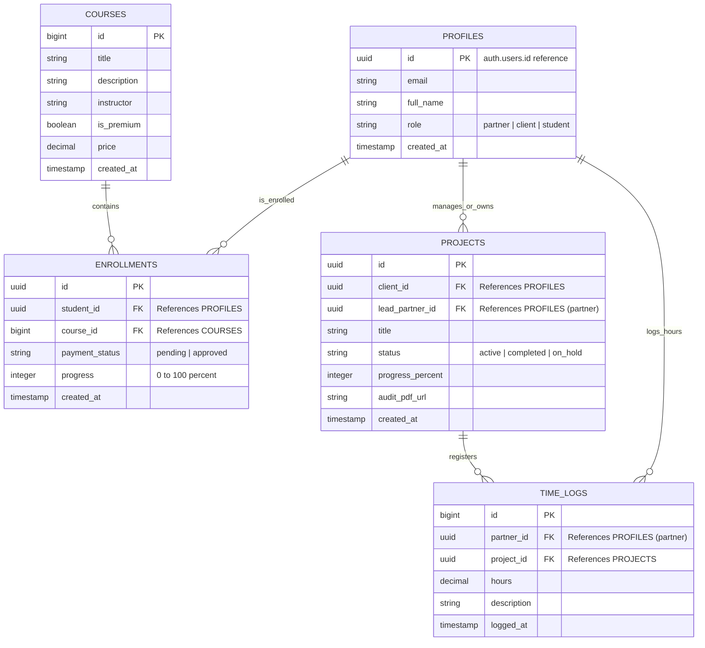

# Esquema y Modelo de Datos PostgreSQL - PROYECTO SERAM

Este documento describe la estructura y diseño relacional de la base de datos PostgreSQL hospedada en **Supabase** para dar soporte a la seguridad RLS, la intranet de socios y la automatización de la plataforma.

---

## 1. Diagrama de Relaciones de Entidad (Mermaid)

---

## 2. Definición Detallada de Tablas y Atributos

### 2.1 Tabla: `profiles`
Almacena la información de perfil asociada a los identificadores de autenticación globales de Supabase.
* `id` (UUID, Primary Key): ID único heredado de la autenticación de Supabase (`auth.users.id`).
* `email` (TEXT, NOT NULL): Correo electrónico del usuario.
* `full_name` (TEXT, NOT NULL): Nombre completo o razón social.
* `role` (TEXT, NOT NULL): Rol del perfil. Valores válidos: `'partner'`, `'client'`, `'student'`.
* `created_at` (TIMESTAMP WITH TIME ZONE, DEFAULT now()): Fecha de registro.

### 2.2 Tabla: `courses`
Catálogo de capacitación ambiental disponible en SERAM Academy.
* `id` (BIGINT, PRIMARY KEY, GENERATED ALWAYS AS IDENTITY): Identificador correlativo de curso.
* `title` (TEXT, NOT NULL): Título del curso.
* `description` (TEXT): Sinopsis y temarios del curso.
* `instructor` (TEXT, NOT NULL): Nombre del instructor a cargo (uno de los socios o externos).
* `is_premium` (BOOLEAN, DEFAULT false): Bandera que indica si el curso es de pago o libre.
* `price` (NUMERIC, DEFAULT 0.00): Costo de inscripción en USD.
* `created_at` (TIMESTAMP WITH TIME ZONE, DEFAULT now()).

### 2.3 Tabla: `enrollments`
Matrículas e historial de progreso de los estudiantes en los cursos de la Academia.
* `id` (UUID, PRIMARY KEY, DEFAULT gen_random_uuid()).
* `student_id` (UUID, FOREIGN KEY REFERENCES `profiles(id)` ON DELETE CASCADE).
* `course_id` (BIGINT, FOREIGN KEY REFERENCES `courses(id)` ON DELETE CASCADE).
* `payment_status` (TEXT, DEFAULT 'pending'): Estado del pago del curso.
* `progress` (INTEGER, DEFAULT 0): Progreso de visualización del alumno (0 a 100).
* `created_at` (TIMESTAMP WITH TIME ZONE, DEFAULT now()).

### 2.4 Tabla: `projects`
Proyectos y estudios ambientales en desarrollo para los clientes corporativos.
* `id` (UUID, PRIMARY KEY, DEFAULT gen_random_uuid()).
* `client_id` (UUID, FOREIGN KEY REFERENCES `profiles(id)`): Cliente corporativo dueño del proyecto.
* `lead_partner_id` (UUID, FOREIGN KEY REFERENCES `profiles(id)`): Socio de SERAM a cargo de liderar la consultoría.
* `title` (TEXT, NOT NULL): Nombre del proyecto o estudio ambiental.
* `status` (TEXT, DEFAULT 'active'): Estado actual del proyecto (`'active'`, `'completed'`, `'on_hold'`).
* `progress_percent` (INTEGER, DEFAULT 0): Porcentaje de avance de la auditoría o estudio.
* `audit_pdf_url` (TEXT): Enlace seguro al archivo PDF en el storage de Supabase.
* `created_at` (TIMESTAMP WITH TIME ZONE, DEFAULT now()).

### 2.5 Tabla: `time_logs`
Control interno de horas aplicadas por los socios a las operaciones del negocio (intranet).
* `id` (BIGINT, PRIMARY KEY, GENERATED ALWAYS AS IDENTITY).
* `partner_id` (UUID, FOREIGN KEY REFERENCES `profiles(id)`): Socio de SERAM que registra las horas.
* `project_id` (UUID, FOREIGN KEY REFERENCES `projects(id)` ON DELETE CASCADE): Proyecto en el que se trabajó.
* `hours` (NUMERIC, NOT NULL): Cantidad de horas dedicadas (ej. 4.5).
* `description` (TEXT): Detalle de la actividad ejecutada.
* `logged_at` (TIMESTAMP WITH TIME ZONE, DEFAULT now()): Fecha de registro del tiempo.
