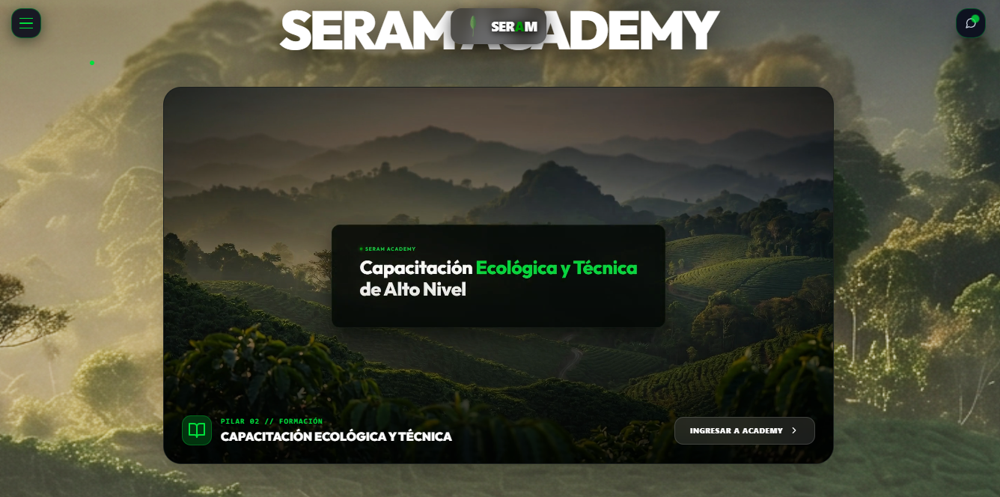

K-019 — Rediseñar composición de HyperFrames para el segmento SERAM ACADEMY, renderizar/comprimir video e integrar en HomePage

## Metadata

- **D:** TASK-019
- **Título:** Rediseñar composición de HyperFrames para representar el funcionamiento de SERAM ACADEMY, renderizar y comprimir el video e integrarlo como visual principal en HomePage.jsx
- **Agente:** Implementador (supervisado por Líder)
- **Fecha inicio:** 2026-07-28 14:00
- **Status:** done

---

## Contexto Inicial

El video del segmento de SERAM Academy en la Landing Page muestra los efectos del cambio climático en Bolivia (Glaciares, Sequías, Inundaciones). Se requiere rediseñar la composición de HyperFrames en `test-hyperframes/index.html` para representar los tres módulos clave de la academia (SIG, Legislación y WebGL/3D), renderizar el video final a MP4, comprimirlo y enlazarlo en la página de inicio.

## Archivos Afectados

- `test-hyperframes/index.html` (composición de animación de la academia)
- `src/features/home/HomePage.jsx` (integración en la Landing Page)

## Plan de Implementación

1. [X] Modificar `test-hyperframes/index.html` con los copys del ecosistema de SERAM Academy y sus 3 módulos formativos.
2. [X] Ejecutar `npm run check` en `test-hyperframes` para validar la composición.
3. [X] Renderizar el video a MP4 mediante `npm run render`.
4. [X] Comprimir el video resultante usando `ffmpeg` con la configuración H.264 Web-friendly (CRF 26).
5. [X] Guardar el video comprimido en `src/public/assets/videos/seram_academy_funcionamiento.mp4`.
6. [X] Modificar `HomePage.jsx` para enlazar el nuevo video.
7. [X] Correr el build de producción para asegurar la calidad final.

## Conclusión

Se completaron todos los pasos satisfactoriamente. El video se renderizó y comprimió a 4.1 MB (una reducción del 82% respecto al archivo crudo), optimizando los tiempos de carga en la web. El build de Vite terminó de manera exitosa y los cambios de React se han verificado localmente.
